# 调试问题记录

## 第一批次采集数据,SVO2轨迹效果比较差

**第一批次数据采集为双目相机图像topic:/imsee/image/left, /imsee/image/right, /imsee/imu**

运行效果:

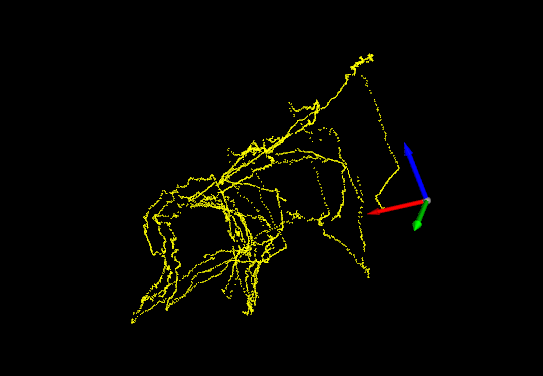

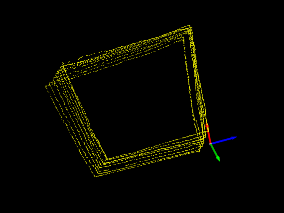

*分析:*

  1. imsee双目相机的/imsee/image/left,/imsee/image/right两个topic的图像去畸变不准,改用/imsee/image/rectify/left, /imsee/image/rectify/right两个topic的图像

  2. 相机到imu的变换矩阵标定不准(**等验证确定**)  

*措施/结果:*

1. 采用/imsee/image/rectify/left, imsee/image/rectify/right

2. 关闭ceres优化

   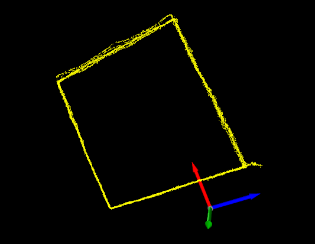

   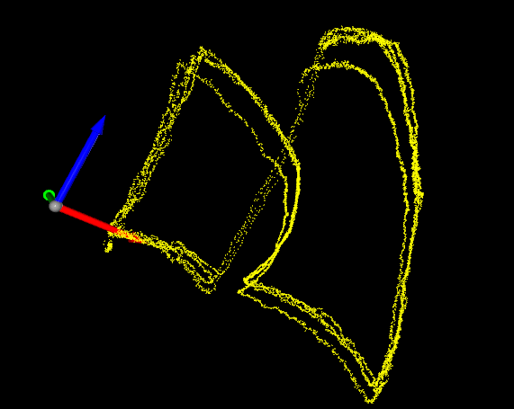

   

- 开启ceres优化轨迹反而变差

**开启ceres优化效果**

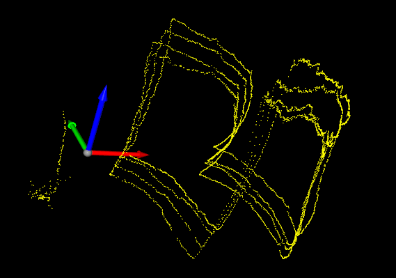

---

## 轨迹为yz平面正方形,最后末端有一旋转,svo轨迹漂走

**机械臂在最后时有一个旋转的动态**

运行效果:

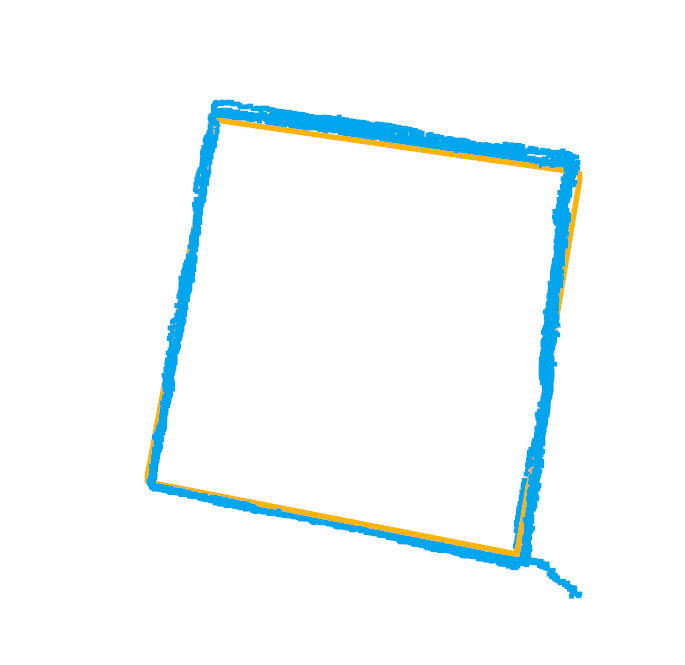

*分析:*

  

*措施/结果:*

  

---

## 机械臂轨迹为弧线,行走过程中视角在变化

运行效果:

- *未开ceres*

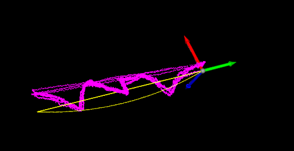

- *开启ceres*

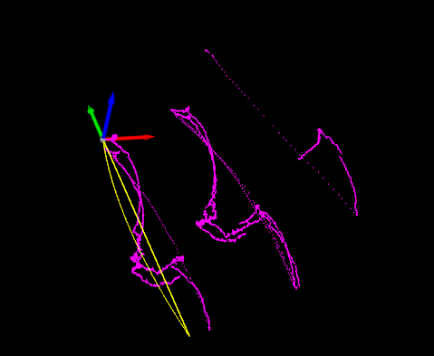

*分析:*

  

*措施/结果:*

  

---

## 机械臂沿x轴走直线

运行效果:

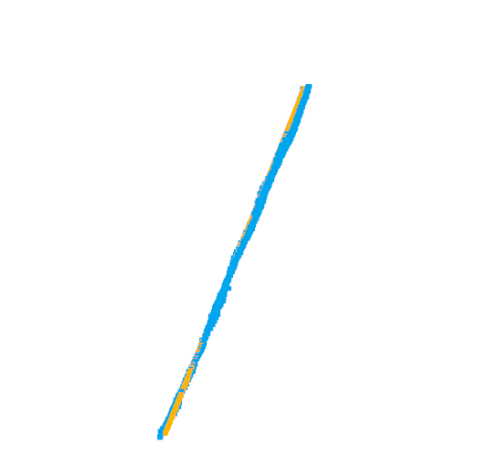

*x,y,z方向位移*

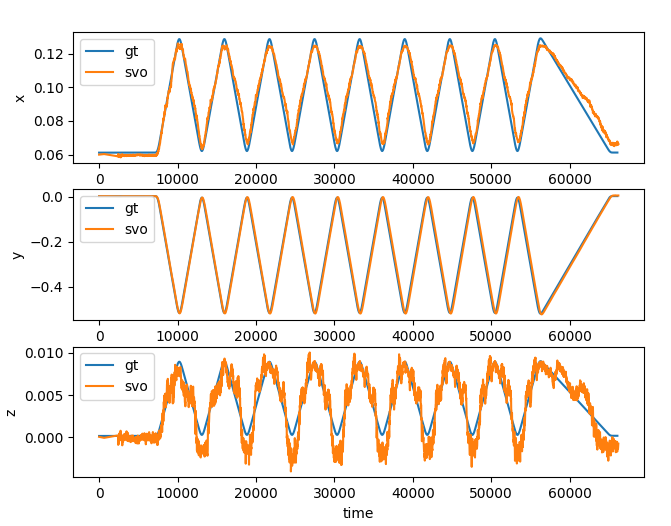

*分析*

*措施/结果*

  直线运行轨迹基本与机械臂一致

## 绕z轴半径45cm弧线运动

运行效果:

- 开启ceres

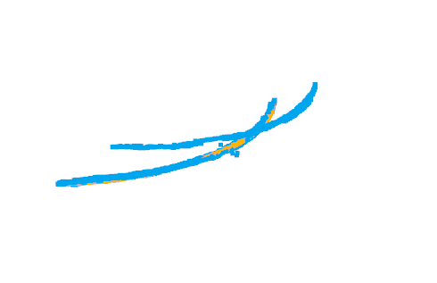

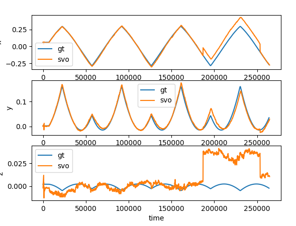

*关ceres*

**svo轨迹有较远的杂散点**

*去掉杂散点后对齐*

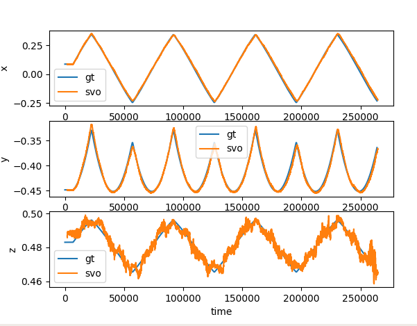

  

## 双目相机绑定到oculus上共同运动

1. 运行效果

   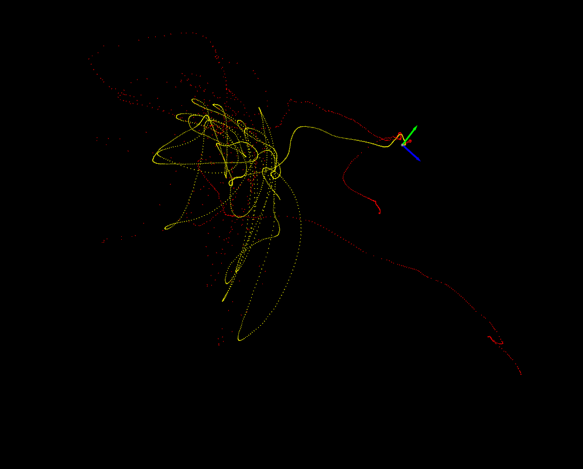

2. 分析

   

3. 措施/结果

   
